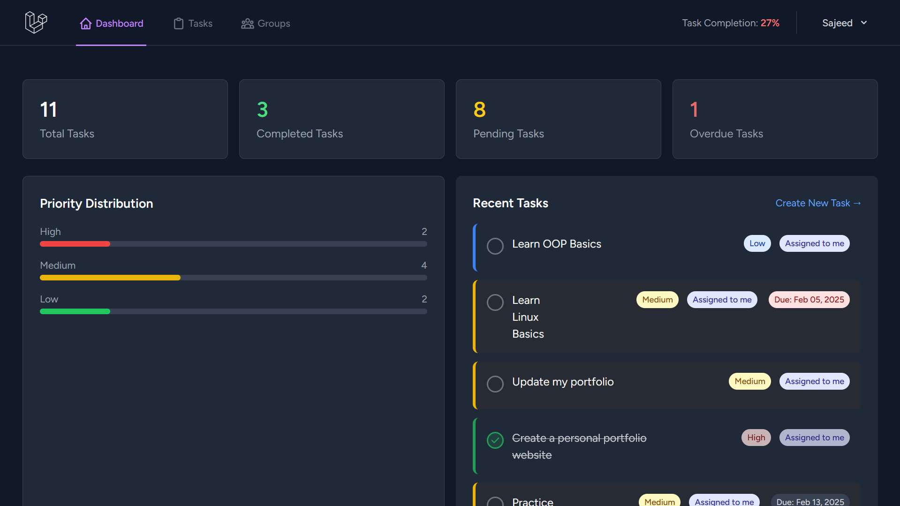
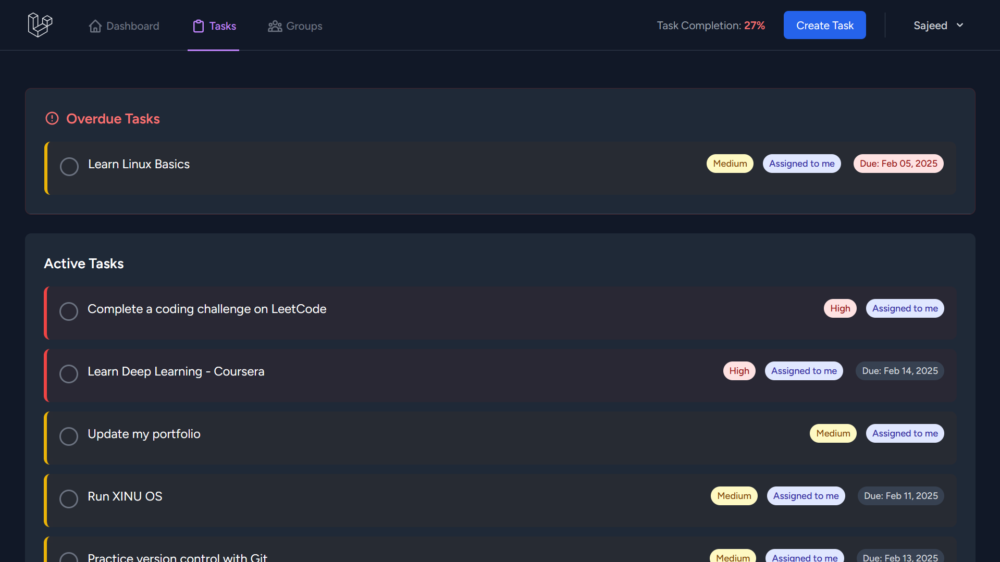
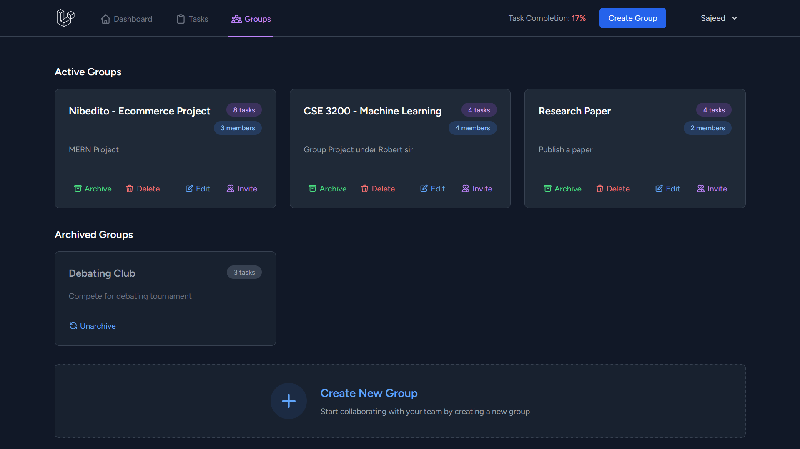
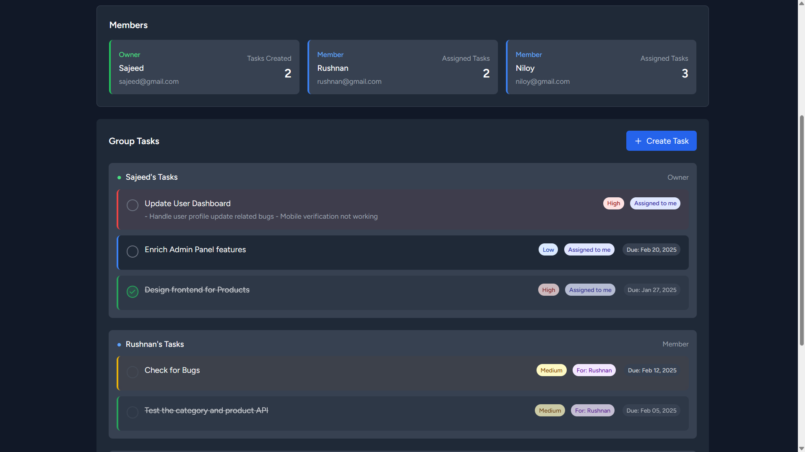

# 🚀 CollabTask

A modern, collaborative task management application built with Laravel and Tailwind CSS.

## 📸 Screenshots

### Dashboard

*Centralized view of your tasks and activities*

### Task Management

*Organize and track your tasks efficiently*

### Group Collaboration

*Work together with team members*

*Manage group tasks and members*

## ✨ Features

### 📋 Task Management
- Create, edit, and delete tasks
- Set task priorities (Low, Medium, High)
- Add due dates and descriptions
- Mark tasks as completed
- Smart task categorization (Active, Completed, Overdue)
- Visual indicators for task status and priority

### 👥 Team Collaboration
- Create and manage task groups
- Invite team members to groups
- Assign tasks to group members
- Track member contributions
- Real-time task completion statistics

### 📊 Dashboard & Analytics
- Personal task completion rate
- Overview of recent tasks
- Pending group invitations
- Quick access to important tasks
- Progress tracking visualization

### 🎨 User Experience
- Clean, modern interface
- Responsive design for all devices
- Dark mode by default
- Intuitive navigation
- Hover effects and smooth transitions
- Priority-based color coding

## 🛠️ Technical Features
- Built with Laravel 11
- Tailwind CSS for styling
- Alpine.js for interactive components
- Database migrations and seeders
- Form validation and error handling
- Authentication and authorization
- Eloquent relationships
- Blade components and partials

## 🚀 Getting Started

1. Clone the repository 
```bash
git clone https://github.com/Ho9pe/task-manager-laravel.git
```
2. Install dependencies
```bash
composer install
npm install
```
3. Configure environment
```bash
cp .env.example .env
php artisan key:generate
```
4. Configure database in `.env` file
```bash
DB_CONNECTION=mysql
DB_HOST=127.0.0.1
DB_PORT=3306
DB_DATABASE=task_manager
DB_USERNAME=root
DB_PASSWORD=
```
5. Run migrations
```bash
php artisan migrate
```
6. Start the development server
```bash
php artisan serve
npm run dev
```

## 📝 License

This project is licensed under the MIT License - see the [LICENSE](LICENSE) file for details.
